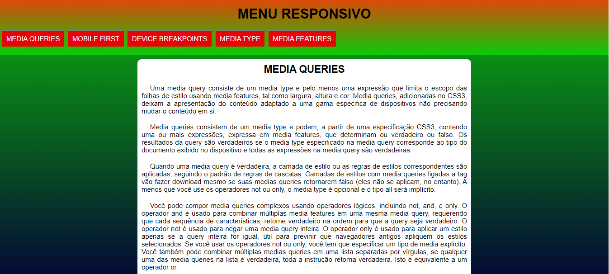
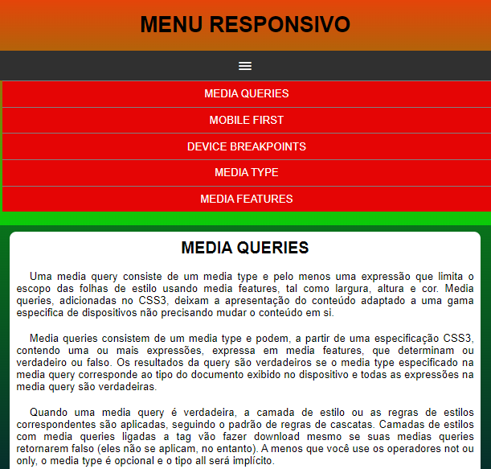

# MENU RESPONSIVO
👨‍🏫PROJETO FEITO PARA O CURSO DE HTML E CSS DO CURSO EM VIDEO.

   
  

## DESCRIÇÃO:
O projeto "Menu Responsivo" apresenta um menu de navegação com funcionalidades responsivas que se adaptam ao tamanho da tela do dispositivo. Aqui estão os recursos principais do projeto:

- **Menu de Navegação:**
  - O menu é exibido como uma lista de itens de navegação.
  - Ao clicar no ícone de menu (representado por três linhas horizontais), o menu é exibido ou ocultado, dependendo do estado atual.
  - O menu é responsivo, ajustando-se dinamicamente ao tamanho da tela do dispositivo.

## EXECUTANDO O PROJETO:
1. Abra o arquivo `CODIGO.html` em um navegador da web.
2. Experimente redimensionar a janela do navegador para ver o comportamento responsivo do menu.
3. Clique no ícone de menu para exibir ou ocultar o menu de navegação.
4. Clique nos itens do menu para acessar os links correspondentes.

## NÃO SABE?
- Entendemos que para manipular arquivos em `HTML`, `CSS` e outras linguagens relacionadas, é necessário possuir conhecimento nessas áreas. Para auxiliar nesse aprendizado, oferecemos cursos gratuitos disponíveis:
* [CURSO DE HTML E CSS](https://github.com/VILHALVA/CURSO-DE-HTML-E-CSS)
* [CURSO DE JAVASCRIPT](https://github.com/VILHALVA/CURSO-DE-JAVASCRIPT)
* [CONFIRA MAIS CURSOS](https://github.com/VILHALVA?tab=repositories&q=+topic:CURSO)

## CREDITOS:
- [PROJETO FEITO PELO VILHALVA](https://github.com/VILHALVA)
- [PROJETO FEITO PARA O CURSO DE HTML E CSS](https://github.com/VILHALVA/CURSO-DE-HTML-E-CSS)
- [ESTÁ DISPONIVEL NO SITE](https://vilhalva.github.io/STYLER/STYLER.html)
